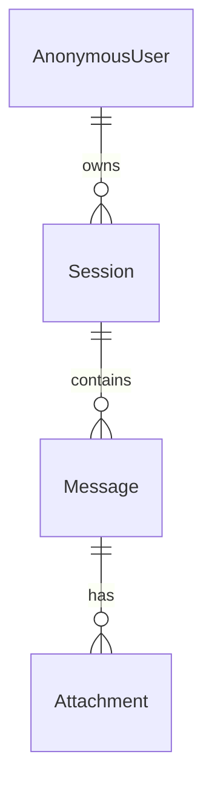

# StudyMate ER Diagram

数据库架构的唯一维护文档已经迁移到：

**[docs/architecture/database.md](docs/architecture/database.md)**

请不要在本文件复制维护第二套 ERD，避免数据库结构发生变化后两份文档不一致。

快速关系：

```mermaid
erDiagram
  AnonymousUser ||--o{ Session : owns
  Session ||--o{ Message : contains
  Message ||--o{ Attachment : has
```
